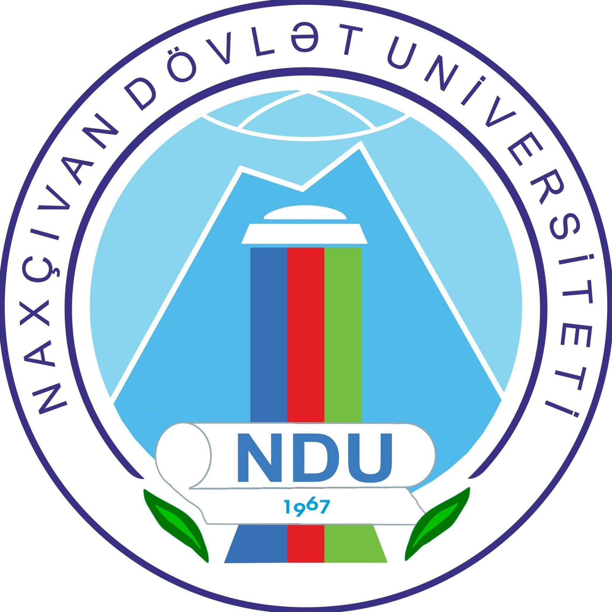

---

layout: col-sidebar
title: OWASP Nakhchivan
tags: owaspazerbaijan
region: Asia
country: Azerbaijan
meetup-group:

---

  

<html lang="en">
<head>
  <meta charset="UTF-8">
  <meta name="viewport" content="width=device-width, initial-scale=1">
  
</head>
<body>

<header>
  <h1>Welcome to OWASP Nakhchivan Chapter</h1>
  
Raising awareness and promoting best practices in application security across the region

</header>

<section>
  <h2>Chapter Leadership</h2>
  

    Our chapter is led by a group of passionate cybersecurity experts and ethical hackers dedicated to advancing secure development practices.
    One of the founding members, <strong>Ilkin Javadov</strong>, is a world renowned white hat hacker who has worked with many government entities and has been awarded numerous medals of recognition and honours, as well as awards for finding vulnerabilities in many well known companies.
    He has also been a speaker at many prestigious cybersecurity conferences and is an active member of numerous cybersecurity organisations.
    With Ilkin Javadov and other leaders, the Nakhchivan Chapter remains a centre for innovation, collaboration, and knowledge sharing in the field of application security.
  

</section>

<section>
  <h2>Our Mission</h2>
  

    OWASP is a global, non profit organization whose mission is to make software security visible and accessible to everyone.
    At OWASP Nakhchivan, our goal is to enrich the local and regional cybersecurity community by organizing events, workshops, and collaborative initiatives focused on application security.
    We aim to foster a culture of secure development, empower developers and professionals with cutting edge knowledge, and contribute to building a more resilient digital ecosystem in Nakhchivan and beyond.
  

</section>

<section>
  <h2>Activities & Impact</h2>
  

    Since its founding, OWASP Nakhchivan has played a pivotal role in elevating cybersecurity awareness in the region.
    Through educational programs, technical seminars, and community led events, we help developers, enterprises, and students adopt security by design approaches in their projects.
    Our chapter’s influence extends across the South Caucasus and neighboring regions, establishing Nakhchivan as a growing center for cybersecurity excellence.
  

</section>

<section>
  <h2> Call for Speakers</h2>
  

    We are currently accepting speaker proposals!  
    If you are interested in presenting at a future OWASP Nakhchivan event, please review the 
    <a href="https://owasp.org/www-policy/legal/speaker-agreement" target="_blank">OWASP Speaker Agreement</a>
    and send your proposed talk title, abstract, and short bio to our chapter leadership via email. ilkin.javadov@owasp.org
  

  
We welcome talks on topics such as:

  <ul>
    <li>Application Security</li>
    <li>Secure Software Development</li>
    <li>Threat Modeling</li>
    <li>Offensive Security / Ethical Hacking</li>
    <li>Cloud and API Security</li>
    <li>AI in Security</li>
  </ul>
</section>

<section>
  <h2>Next Events</h2>

    📢 <strong>Next Event: OWASP Cybersecurity Meetup at Nakhchivan State University</strong>  
   
    🗓️ <strong>Date:</strong> October 1, 2025 
    📍 <strong>Location:</strong> Nakhchivan State University (NDU) Campus 
    🎓 <strong>Audience:</strong> Open to all students of Nakhchivan State University  

    Join us for a dynamic session on Application Security, Ethical Hacking, and Cybersecurity Trends! 
    Participants will gain insights into global security standards, real-world vulnerabilities, and how to become part of the OWASP global community.
  

</section>

<section>
  <h2> Stay Connected</h2>
  <ul>
    <li><a href="https://www.linkedin.com/company/owasp-nakhchivan">LinkedIn: OWASP Nakhchivan Chapter</a></li>
  </ul>
</section>

<section>
  <h2> Join the Community</h2>
  <ul>
    <li><a href="https://owasp.org/membership/" target="_blank">Become an OWASP Member</a></li>
    <li><a href="#">Subscribe to our Mailing List</a></li>
    <li><a href="https://owasp.org/chapters/" target="_blank">Local Chapter Support Guidelines</a></li>
    <li><a href="https://owasp.org/www-policy/operational/code-of-conduct" target="_blank">Code of Conduct</a></li>
  </ul>
</section>

<footer>
  
© 2025 OWASP Nakhchivan Chapter. All rights reserved.

</footer>

</body>
</html>

